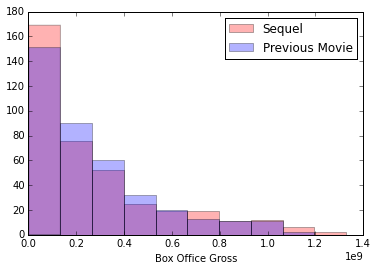

##Project Description
A movie studio has approached me with the goal of predicting the success of sequels. They own the rights to many different franchises and want to be able to analyze their current and future movie portfolio to help them more effectively choose whether or not to proceed with a sequel.

**Note:** For purposes of this project, we will judge the 'success' of a movie to be the box office gross of the movie.

##Exploratory Data Analysis:
I began by plotting a histogram of the box office numbers for both the previous movies and the sequels.

The two plots have relatively similar shapes to their distribution. This most likely suggests a correlation that we will explore later on.

##Regression Models
