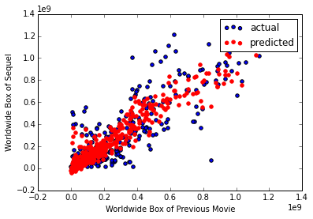
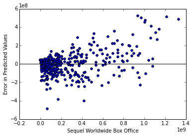

##Project Description
A movie studio has approached me with the goal of predicting the success of sequels. They own the rights to many different franchises and want to be able to analyze their current and future movie portfolio to help them more effectively choose whether or not to proceed with a sequel.

**Note:** For purposes of this project, we will judge the 'success' of a movie to be the box office gross of the movie.

##Exploratory Data Analysis:
I began by plotting a histogram of the box office numbers for both the previous movies and the sequels.

The two plots have relatively similar shapes to their distribution. This most likely suggests a correlation that we will explore later on.

##Linear Regression Models
Building a linear model to predict the box office success of a movie based only on the box office of the previous movie yields an adjusted R-Squared of 0.716.

The plot of actual values, predicted values, and y=x can be seen below:

The line of predicted values is almost exactly the same as the line for y=x. This suggests that a sequel can be expected to perform about as well as its predecessor at the box office.

The current best performing model has an adjusted R-Squared of 0.789 and contains the following attributes:

1. Box Office of previous movie
2. Percentage of Top 10 billed actors for previous movie that appear in sequel
3. The number of the movie in the series
4. The budget of the movie
  * This can be included because typically a studio will have a projected budget in mind when choosing whether or not to make a sequel

The plot of actual values and values predicted by this model is below:

**Residual Analysis**
This led to a few interesting points that need to be studied further

1. There is far less variance in the residuals for movies that had a lower box office showing
2. The model generally overpredicted for movies with a low box office and underpredicted for movies with a large box office.
 * For some of the high box office movies, the model was off by almost $600,000,000!
 
 The residual plot is below:
 
 
 
 
 ##Additional Observations and Future Work
1. The coefficient of 7.05e7 for the cast percentage is particularly interesting. Basically, it suggests that a sequel with all of its original cast members will outperform a sequel with no returning cast members by $70,000,000!
 * On average, a top ten billed cast member is worth about $7,000,000 to the sequel. Therefore, it's worth it to get them back...but only for the right price.
 ** It will be interesting to explore further how much different cast members are worth.
 * 74 of the movies (out of 391) had no returning cast movies. I should try to classify these movies as spinoffs, Reboots, Remakes, etc.
2. I would like to look into the time between movies as a factor. It could also help to classify a reboot or remake.
3. I would also like to look into the genre and the source material, as well as the interaction between the two.
4. Finding a more complete list of video sales would allow for analysis of that factor.
